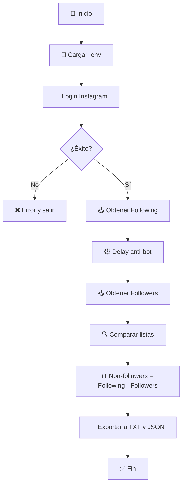

# DETECTOR DE FALSOS REALES HDLV

Bot para identificar cuentas de Instagram que sigues pero **no te siguen de vuelta**.

## Inicio Rápido

```bash
# 1. Instalar dependencias
pip install -r requirements.txt

# 2. Configurar credenciales
cp .env.example .env
# Editar .env con tu usuario y contraseña

# 3. Ejecutar
python main.py
```

## 📁 Estructura

```
bot-ig/
├── main.py              # Punto de entrada
├── config.py            # Configuración
├── modules/
│   ├── auth.py          # Autenticación (soporta 2FA)
│   ├── scraper.py       # Obtener following/followers
│   ├── analyzer.py      # Detectar non-followers
│   └── exporter.py      # Exportar resultados
├── utils/
│   ├── logger.py        # Logs con colores
│   └── rate_limiter.py  # Anti-detección
└── output/              # Archivos generados
```

## Flujo del Programa (lo unico hecho por ia antes de que critiquen los emojis)



## Salida

El bot genera archivos en `output/`:

| Archivo | Contenido |
|---------|-----------|
| `non_followers_*.txt` | Lista simple de @usernames |
| `non_followers_*.json` | Datos completos + estadísticas |

### Ejemplo de salida en consola:

```
============================================================
 FALSOS REALES
============================================================
Total de falsos: 15
------------------------------------------------------------
  1. @cuenta_ejemplo1
  2. @cuenta_ejemplo2 🔒 (Cuenta Privada)
  3. @cuenta_ejemplo3
============================================================
```

## Configuración

Edita el archivo `.env`:

```env
INSTAGRAM_USERNAME=tu_usuario
INSTAGRAM_PASSWORD=tu_contraseña

# Delays entre requests (segundos)
MIN_DELAY=1.0
MAX_DELAY=3.0

# Nivel de logs: DEBUG, INFO, WARNING, ERROR
LOG_LEVEL=INFO
```

##  Limitaciones

- **Rate limits**: Instagram limita ~200 requests/hora
- **Detección de bots**: Usa delays aleatorios automáticamente
- **2FA**: Soportado, pedirá el código por consola
- **Recomendación**: Ejecutar máximo 1-2 veces al día

