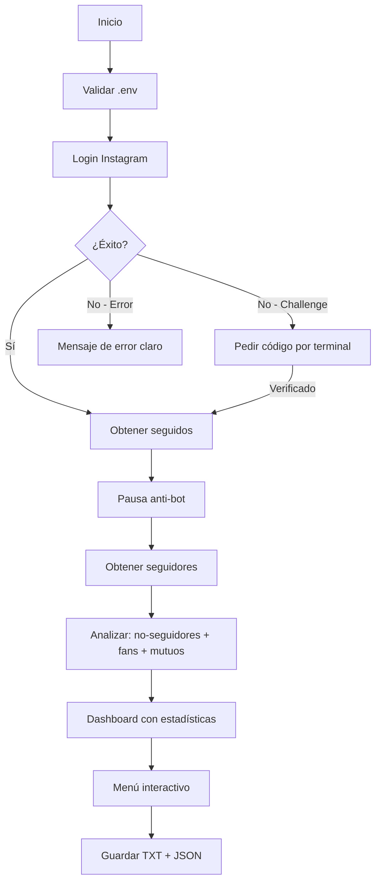

# DETECTOR DE FALSOS REALES

Bot para identificar cuentas de Instagram que sigues pero **no te siguen de vuelta**, tus fans, y tus mutuos.

## Inicio Rápido

```bash
# 1. Instalar dependencias
pip install -r requirements.txt

# 2. Configurar credenciales
cp .env.example .env
# Editar .env con tu usuario y contraseña

# 3. Ejecutar
python main.py
```

## 📁 Estructura

```
bot-ig/
├── main.py              # Punto de entrada con menú interactivo
├── config.py            # Configuración y validación
├── modules/
│   ├── entrada.py       # Autenticación (soporta 2FA + challenges)
│   ├── buscador.py      # Obtener seguidos/seguidores con reintentos
│   ├── comparador.py    # Detectar no-seguidores, fans, mutuos
│   └── guardador.py     # Reportes en pantalla, TXT y JSON
├── utils/
│   ├── registro.py      # Logs con colores
│   └── control_tiempo.py # Anti-detección adaptativo
└── output/              # Archivos generados
```

## Flujo del Programa


```mermaid
flowchart TD
    A[Inicio] --> B[Validar .env]
    B --> C[Login Instagram]
    C --> D{¿Éxito?}
    D -->|No - Challenge| E[Pedir código por terminal]
    D -->|No - Error| F[Mensaje de error claro]
    D -->|Sí| G[Obtener seguidos]
    E -->|Verificado| G
    G --> H[Pausa anti-bot]
    H --> I[Obtener seguidores]
    I --> J[Analizar: no-seguidores + fans + mutuos]
    J --> K[Dashboard con estadísticas]
    K --> L[Menú interactivo]
    L --> M[Guardar TXT + JSON]
```

## Funcionalidades

| Función | Descripción |
|---------|-------------|
| **No seguidores** | Quién sigues pero no te sigue de vuelta |
| **Fans** | Quién te sigue pero tú no sigues |
| **Mutuos** | Se siguen mutuamente |
| **Dashboard** | Estadísticas: ratio, reciprocidad, totales |
| **Reintentos** | Login y búsqueda con backoff exponencial |
| **Challenges** | Manejo interactivo de verificaciones de Instagram |

## Salida

El bot genera archivos en `output/`:

| Archivo | Contenido |
|---------|-----------|
| `reporte_*.txt` | Listas con links directos a instagram.com |
| `reporte_*.json` | Datos completos + estadísticas |

### Ejemplo de salida en consola:

```
─────────────────────────────────────────────────────
  📊  RESUMEN DE TU CUENTA
─────────────────────────────────────────────────────

  Seguidos         450
  Seguidores       380
  ─────────────────────────
  Mutuos           340
  No te siguen     110
  Fans              40

  Ratio            0.84
  Reciprocidad     75.6%
```

## Configuración

Edita el archivo `.env`:

```env
INSTAGRAM_USERNAME=tu_usuario
INSTAGRAM_PASSWORD=tu_contraseña

# Delays entre requests (segundos)
MIN_DELAY=2.0
MAX_DELAY=5.0

# Reintentos de login
MAX_REINTENTOS=3

# Nivel de logs: DEBUG, INFO, WARNING, ERROR
LOG_LEVEL=INFO
```

## Limitaciones

- **Rate limits**: Instagram limita ~200 requests/hora
- **Detección de bots**: Usa delays aleatorios y adaptativos
- **2FA**: Soportado, pide el código en la terminal
- **Challenges**: Si Instagram bloquea, te guía para verificar desde la app
- **Recomendación**: Ejecutar máximo 1-2 veces al día
- **Contraseña en .env**: NO usar comillas alrededor de la contraseña
